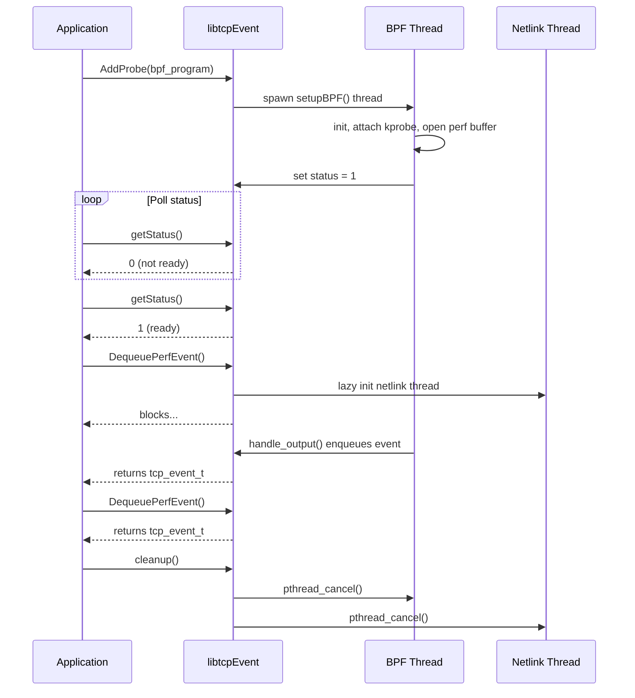

## Function Reference

### AddProbe()

Initializes and starts the TCP event monitoring system in a background thread.

```c
extern void AddProbe(const char *BPF_PROGRAM);
```

<ParamField path="BPF_PROGRAM" type="const char *" required>
  Path to the BPF program source file (C code) to be compiled and loaded into the kernel. This program defines the eBPF probe logic for intercepting TCP state changes.
</ParamField>

**Return Value**: None (void)

**Behavior**:
- Prints version information: `"tcpTracer Ver 1.03e with BCC <version>"`
- Spawns a detached thread that calls `setupBPF()`
- Returns immediately (non-blocking)
- Background thread continues indefinitely until `cleanup()` is called

**Thread Safety**: Safe to call once at initialization. Do not call multiple times.

**Example**:

```c
#include "event.h"
#include <stdio.h>

int main() {
    const char *bpf_program = "/opt/RealTimeKql/probes/tcp_probe.c";
    
    // Start monitoring TCP events
    AddProbe(bpf_program);
    
    // Wait for BPF initialization
    while (getStatus() == 0) {
        usleep(100000);
    }
    
    printf("TCP monitoring active\n");
    
    // Continue with event processing...
    return 0;
}
```

---

### setupBPF()

Performs the actual BPF initialization, probe attachment, and event polling (runs in background thread).

```c
extern int setupBPF(const char *BPF_PROGRAM);
```

<ParamField path="BPF_PROGRAM" type="const char *" required>
  Path to the BPF program source file.
</ParamField>

**Return Value**: 
- `0` on success (never reached in normal operation due to infinite loop)
- `1` on failure (initialization error)

**Behavior**:
1. Initializes BPF subsystem with the provided program
2. Attaches kprobe to `tcp_set_state` kernel function
3. Opens perf buffer named `TABLE` ("tcpEvents")
4. Frees BCC compiler memory
5. Sets status flag to `1` (ready)
6. Enters infinite loop polling the perf buffer
7. Calls `handle_output()` callback when events arrive

**Error Handling**:
- Prints error messages to stderr on failure
- Calls `exit(1)` on any initialization error

**Thread Safety**: Intended to run in dedicated thread spawned by `AddProbe()`. Do not call directly from multiple threads.

**Example** (typically called internally):

```c
// Called internally by AddProbe() - shown for reference
int setupBPF(const char *BPF_PROGRAM) {
    // BPF initialization sequence
    auto init_res = bpf.init(BPF_PROGRAM);
    if (init_res.code() != 0) {
        std::cerr << init_res.msg() << std::endl;
        exit(1);
    }
    
    // Attach to tcp_set_state kernel function
    auto attach = bpf.attach_kprobe("tcp_set_state", "kprobe__tcp_set_state");
    if (attach.code()) {
        std::cerr << attach.msg() << std::endl;
        exit(1);
    }
    
    // Begin polling...
    while (1) {
        bpf.poll_perf_buffer("tcpEvents");
    }
}
```

---

### DequeuePerfEvent()

Returns the next TCP event from the queue, blocking if no events are available.

```c
struct tcp_event_t DequeuePerfEvent();
```

**Parameters**: None

**Return Value**: `struct tcp_event_t` containing enriched TCP connection event data (see [Data Structures](/api/tcp/data-structures) for field details)

**Behavior**:
- **Blocking**: Waits on condition variable until events are available
- Lazy-initializes netlink probe thread on first call
- Dequeues event from front of queue (FIFO)
- Converts internal `event_t` to consumer-facing `tcp_event_t`:
  - Adjusts timestamps from boot-relative to absolute epoch nanoseconds
  - Converts binary IP addresses to string format (SADDR/DADDR)
  - Copies process name (task)
- Reclaims memory for internal event structure
- Returns populated `tcp_event_t` struct by value

**Thread Safety**: Thread-safe. Uses mutex and condition variable for synchronization.

**Blocking Behavior**:

<Warning>
  This function **blocks indefinitely** until an event is available. Design your application to handle blocking (e.g., dedicate a thread to event collection or use in an event loop).
</Warning>

**Example**:

```c
#include "event.h"
#include <stdio.h>
#include <unistd.h>

void *event_consumer_thread(void *arg) {
    while (1) {
        // Blocks until next event
        struct tcp_event_t event = DequeuePerfEvent();
        
        // Process the event
        printf("[%lu] %s (PID %u) %s:%u -> %s:%u\n",
               event.EventTime,
               event.task,
               event.pid,
               event.SADDR, event.SPT,
               event.DADDR, event.DPT);
        
        printf("  TX: %lu bytes (%u packets)\n", 
               event.tx_b, event.tcpi_segs_out);
        printf("  RX: %lu bytes (%u packets)\n", 
               event.rx_b, event.tcpi_segs_in);
    }
    return NULL;
}

int main() {
    AddProbe("/path/to/bpf_program.c");
    
    while (getStatus() == 0) {
        usleep(100000);
    }
    
    pthread_t consumer;
    pthread_create(&consumer, NULL, event_consumer_thread, NULL);
    pthread_join(consumer, NULL);
    
    return 0;
}
```

---

### cleanup()

Detaches the BPF probe and cleans up resources.

```c
extern void cleanup();
```

**Parameters**: None

**Return Value**: None (void)

**Behavior**:
- Prints `"Cleaning up!"`
- Detaches kprobe from `tcp_set_state` kernel function
- Cancels BPF polling thread (if active)
- Cancels netlink probe thread (if active)
- Calls `exit(1)` if detach fails

**Thread Safety**: Safe to call from main thread. Uses `pthread_cancel()` to terminate background threads.

**Example**:

```c
#include <signal.h>
#include "event.h"

void signal_handler(int signum) {
    printf("Caught signal %d, cleaning up...\n", signum);
    cleanup();
    exit(0);
}

int main() {
    signal(SIGINT, signal_handler);
    signal(SIGTERM, signal_handler);
    
    AddProbe("/path/to/bpf_program.c");
    
    while (1) {
        struct tcp_event_t event = DequeuePerfEvent();
        // Process event...
    }
    
    return 0;
}
```

<Warning>
  `cleanup()` calls `exit(1)` if the kprobe detachment fails. Ensure critical data is saved before calling.
</Warning>

---

### getStatus()

Returns the initialization status of the BPF probe.

```c
extern unsigned getStatus();
```

**Parameters**: None

**Return Value**: 
- `0` - BPF probe not yet initialized
- `1` - BPF probe initialized and active

**Behavior**:
- Acquires read lock on status variable
- Returns current status value
- Releases read lock

**Thread Safety**: Thread-safe. Uses read-write lock (`pthread_rwlock_t`).

**Example**:

```c
#include "event.h"
#include <stdio.h>
#include <unistd.h>

int main() {
    AddProbe("/path/to/bpf_program.c");
    
    printf("Waiting for BPF initialization...\n");
    int waited = 0;
    while (getStatus() == 0) {
        usleep(100000); // 100ms
        waited++;
        if (waited > 100) { // 10 second timeout
            fprintf(stderr, "Timeout waiting for BPF initialization\n");
            return 1;
        }
    }
    
    printf("BPF probe ready after %d ms\n", waited * 100);
    
    // Begin event processing...
    return 0;
}
```

---

### printCharArray()

Utility function to print a character array (debugging).

```c
extern void printCharArray(const char *charPtr);
```

<ParamField path="charPtr" type="const char *" required>
  Pointer to null-terminated character array to print.
</ParamField>

**Return Value**: None (void)

**Behavior**:
- Prints `"Array: "` followed by the string content to stdout
- Appends newline

**Thread Safety**: Not thread-safe (uses printf without synchronization).

**Example**:

```c
struct tcp_event_t event = DequeuePerfEvent();
printCharArray(event.SADDR); // Output: Array: 192.168.1.100
printCharArray(event.task);  // Output: Array: nginx
```

## Function Call Sequence

Typical initialization and usage sequence:


