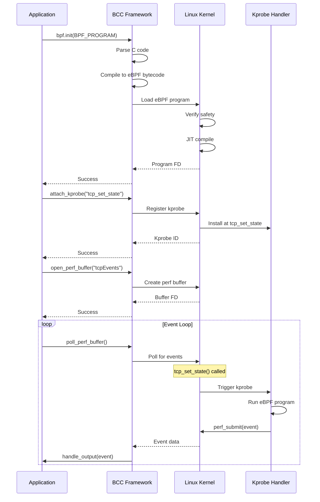

## What is eBPF?

eBPF (extended Berkeley Packet Filter) is a revolutionary Linux kernel technology that allows programs to run in kernel space without requiring kernel modules or modifications. Originally designed for packet filtering, eBPF has evolved into a general-purpose execution engine for safe, efficient kernel instrumentation.

<Info>
The eBPF Event Interceptor uses eBPF to monitor TCP and UDP network activity with minimal overhead and no kernel modifications.
</Info>

## Why eBPF for Network Monitoring?

### Traditional Approaches vs eBPF

<CardGroup cols={2}>
  <Card title="Kernel Modules" icon="warning">
    **Risks:**
    - Can crash entire system
    - No safety verification
    - Complex to maintain
    - Security vulnerabilities
    
    **Benefits:**
    - Full kernel access
    - Maximum flexibility
  </Card>
  
  <Card title="eBPF Programs" icon="shield-check">
    **Benefits:**
    - Verified safe before loading
    - Cannot crash kernel
    - Sandboxed execution
    - No recompilation needed
    
    **Constraints:**
    - Limited instruction set
    - Stack size limits
    - Bounded loops only
  </Card>
</CardGroup>

### Key Advantages

1. **Safety:** eBPF verifier ensures programs terminate and don't crash the kernel
2. **Performance:** Runs in kernel context without context switching
3. **Flexibility:** Load/unload programs dynamically without rebooting
4. **Observability:** Zero application code changes required
5. **Security:** Cannot access arbitrary kernel memory

## BCC: BPF Compiler Collection

This project uses **BCC** (BPF Compiler Collection) to simplify eBPF program development.

<Note>
BCC version is displayed at startup:
```
tcpTracer Ver 1.03e with BCC 0.x.x
UDP Tracer Ver 1.04b with BCC 0.x.x
```
</Note>

### BCC Components

```
┌─────────────────────────────────────────────────────────┐
│                  Application Code                       │
│                  (event.cc, udpTracer.cc)              │
└────────────────────┬────────────────────────────────────┘
                     │
                     │ #include "BPF.h"
                     ▼
┌─────────────────────────────────────────────────────────┐
│                  BCC Framework (libbcc)                 │
│  ┌─────────────┐  ┌──────────────┐  ┌──────────────┐  │
│  │   Compiler  │  │  Verifier    │  │ Perf Buffer  │  │
│  │   (Clang)   │→ │  Interface   │→ │  Manager     │  │
│  └─────────────┘  └──────────────┘  └──────────────┘  │
└────────────────────┬────────────────────────────────────┘
                     │
                     ▼
┌─────────────────────────────────────────────────────────┐
│                   Linux Kernel                          │
│  ┌──────────────────────────────────────────────────┐  │
│  │             eBPF Virtual Machine                 │  │
│  │  - Verifier checks program safety               │  │
│  │  - JIT compiler optimizes for native execution  │  │
│  │  - Runtime executes attached probes             │  │
│  └──────────────────────────────────────────────────┘  │
└─────────────────────────────────────────────────────────┘
```

### BCC API Usage

**1. Initialize BPF Program:**
```cpp
ebpf::BPF bpf;
auto init_res = bpf.init(BPF_PROGRAM);
if (init_res.code() != 0) {
    std::cerr << init_res.msg() << std::endl;
    exit(1);
}
```

**2. Attach Kprobe:**
```cpp
// TCP: Attach to tcp_set_state kernel function
auto attach = bpf.attach_kprobe("tcp_set_state", "kprobe__tcp_set_state");

// UDP: Attach to multiple functions
bpf.attach_kprobe("udp_sendmsg", "kprobe__udp_sendmsg");
bpf.attach_kprobe("udp_recvmsg", "kprobe_udp_recvmsg");

// Return probe captures function return value
bpf.attach_kprobe("udp_recvmsg", "kretprobe__udp_recvmsg", 
                  0, BPF_PROBE_RETURN, 0);
```

**3. Open Perf Buffer:**
```cpp
auto openResults = bpf.open_perf_buffer("tcpEvents", &handle_output);
if (openResults.code()) {
    std::cerr << openResults.msg() << std::endl;
    exit(1);
}
```

**4. Poll for Events:**
```cpp
while (1) {
    bpf.poll_perf_buffer("tcpEvents");  // Blocks until event arrives
}
```

**5. Cleanup:**
```cpp
bpf.free_bcc_memory();      // Free compiler resources
bpf.detach_kprobe("tcp_set_state");
```

## Kprobes: Dynamic Kernel Instrumentation

### What are Kprobes?

Kprobes allow eBPF programs to execute when specific kernel functions are called. Two types exist:

- **kprobe:** Executes at function entry (before function runs)
- **kretprobe:** Executes at function return (after function completes)

<Warning>
Kprobes attach to kernel function names, which can change between kernel versions. This implementation targets common functions stable across kernel 4.x-5.x+.
</Warning>

### TCP Kprobes

The TCP interceptor attaches to a single critical function:

```cpp
#define FN_NAME "tcp_set_state"

bpf.attach_kprobe(FN_NAME, "kprobe__tcp_set_state");
```

**Why `tcp_set_state`?**

This function is called whenever a TCP connection changes state (SYN_SENT → ESTABLISHED → FIN_WAIT1 → etc.). It provides:

- Connection establishment events
- Connection teardown events
- Access to `struct sock*` containing all connection metadata

**TCP State Machine:**
```
CLOSED → LISTEN → SYN_RECV → ESTABLISHED → FIN_WAIT1 → 
FIN_WAIT2 → TIME_WAIT → CLOSE

            ↑ tcp_set_state() called at each transition
```

### UDP Kprobes

UDP is connectionless, so the interceptor tracks operations across multiple functions:

```cpp
// Connection setup (for connected UDP sockets)
ip4_datagram_connect → kprobe_ip4_datagram_connect
ip6_datagram_connect → kprobe_ip6_datagram_connect

// Data transmission
udp_sendmsg          → kprobe__udp_sendmsg          (IPv4 send)
udpv6_sendmsg        → kprobe__udpv6_sendmsg        (IPv6 send)

// Data reception
udp_recvmsg          → kprobe_udp_recvmsg           (Entry probe)
                     → kretprobe__udp_recvmsg        (Return probe)
udpv6_recvmsg        → kprobe__udpv6_recvmsg        (Entry probe)
                     → kretprobe__udpv6_recvmsg      (Return probe)

// Socket cleanup
udp_destruct_sock    → kprobe_udp_destruct_sock     (Final stats)
```

<Accordion title="UDP Send/Receive Pattern">
**Send Operation:**
```c
int kprobe__udp_sendmsg(struct pt_regs *ctx, struct sock *sk, 
                        struct msghdr *msg, size_t len) {
    struct event_t *eventPtr = otherHash.lookup(&pointerInt);
    if (eventPtr) {
        eventPtr->tx_b += len;    // Accumulate bytes sent
        eventPtr->txPkts += 1;    // Count packets
        bpfHelper(eventPtr);      // Update timestamp, PID, UID
        skHelper(ctx, eventPtr, sk);  // Extract socket info
    }
    return 0;
}
```

**Receive Operation (Return Probe):**
```c
int kretprobe__udp_recvmsg(struct pt_regs *ctx) {
    int ret = PT_REGS_RC(ctx);  // Get return value = bytes received
    if (ret > 0) {
        // Lookup socket pointer saved in entry probe
        unsigned long *found = magic.lookup(&pidTgid);
        struct event_t *eventPtr = otherHash.lookup(&sockPtr);
        if (eventPtr) {
            eventPtr->rx_b += ret;   // Accumulate bytes received
            eventPtr->rxPkts += 1;   // Count packets
        }
    }
    return 0;
}
```
</Accordion>

### Kprobe Attachment Process

From `setupBPF()` in udpTracer.cc:394-471:

```cpp
int setupBPF() {
    // 1. Initialize BPF subsystem
    auto init_res = bpf.init(BPF_PROGRAM);
    
    // 2. Attach each kprobe, store names for cleanup
    std::vector<std::string> fNamesVector;
    
    auto d = bpf.attach_kprobe("ip6_datagram_connect", 
                                "kprobe_ip6_datagram_connect");
    if (d.code()) {
        std::cerr << d.msg() << std::endl;
        return 1;
    }
    fNamesVector.push_back("ip6_datagram_connect");
    
    // ... repeat for all 9 probes ...
    
    // 3. Display attached probes
    for (auto probeName : fNamesVector) {
        std::cout << "Attached: " << probeName << std::endl;
    }
    
    // 4. Setup perf buffer and start polling
    bpf.open_perf_buffer("bpfPerfBuffer", &handle_output);
    
    while (1) {
        bpf.poll_perf_buffer("bpfPerfBuffer");
    }
}
```

## eBPF Program Structure

### TCP eBPF Program

The TCP eBPF code is loaded from external source (passed to `setupBPF()`). Key elements:

```c
#include <uapi/linux/ptrace.h>
#include <linux/tcp.h>
#include <net/sock.h>
#include <bcc/proto.h>

// Perf buffer declaration
BPF_PERF_OUTPUT(tcpEvents);

// Main kprobe function
int kprobe__tcp_set_state(struct pt_regs *ctx, struct sock *sk, int state) {
    // Read socket information
    u16 family = sk->__sk_common.skc_family;
    u16 dport = sk->__sk_common.skc_dport;
    
    // Get process context
    u64 pid_tgid = bpf_get_current_pid_tgid();
    u32 pid = pid_tgid >> 32;
    u32 uid = bpf_get_current_uid_gid() & 0xffffffff;
    
    // Build event structure
    struct event_t event = {};
    event.pid = pid;
    event.UserId = uid;
    event.EventTime = bpf_ktime_get_ns();
    event.family = family;
    event.DPT = ntohs(dport);
    
    // Submit to user space
    tcpEvents.perf_submit(ctx, &event, sizeof(event));
    return 0;
}
```

### UDP eBPF Program

The UDP program is embedded directly in udpTracer.cc:58-386:

```cpp
const char *BPF_PROGRAM = R"(
#include <uapi/linux/ptrace.h>
#include <net/sock.h>

// Data structures
struct event_t {
    u16 family;
    u32 pid;
    u64 EventTime;
    u16 SPT, DPT;
    unsigned __int128 saddr, daddr;
    u64 rx_b, tx_b;
    u32 rxPkts, txPkts;
    uintptr_t sockPtr;
};

// Perf buffer
BPF_PERF_OUTPUT(bpfPerfBuffer);

// Hash maps for state tracking
BPF_HASH(magic, u64, unsigned long);           // pid_tgid → sock*
BPF_HASH(otherHash, uintptr_t, struct event_t); // sock* → event

// Helper to populate event fields
static void bpfHelper(struct event_t *eventPtr) {
    if (!eventPtr->pid)
        eventPtr->pid = bpf_get_current_pid_tgid() >> 32;
    if (!eventPtr->UserId)
        eventPtr->UserId = bpf_get_current_uid_gid() & 0xffffffff;
    if (!eventPtr->EventTime)
        eventPtr->EventTime = bpf_ktime_get_ns();
    if (!eventPtr->task[0])
        bpf_get_current_comm(eventPtr->task, sizeof(eventPtr->task));
}

// Helper to extract socket information
static void skHelper(struct pt_regs *ctx, struct event_t *eventPtr, 
                     struct sock *sk) {
    eventPtr->family = sk->__sk_common.skc_family;
    eventPtr->SPT = sk->__sk_common.skc_num;
    
    if (eventPtr->family == AF_INET) {
        eventPtr->saddr = sk->__sk_common.skc_rcv_saddr;
        eventPtr->daddr = sk->__sk_common.skc_daddr;
    } else if (eventPtr->family == AF_INET6) {
        bpf_probe_read_kernel(&eventPtr->saddr, sizeof(eventPtr->saddr),
            sk->__sk_common.skc_v6_rcv_saddr.in6_u.u6_addr32);
        bpf_probe_read_kernel(&eventPtr->daddr, sizeof(eventPtr->daddr),
            sk->__sk_common.skc_v6_daddr.in6_u.u6_addr32);
    }
    
    u16 dport = sk->__sk_common.skc_dport;
    eventPtr->DPT = ntohs(dport);
    
    bpfPerfBuffer.perf_submit(ctx, eventPtr, sizeof(*eventPtr));
}

// ... kprobe implementations ...
)";
```

<Info>
The UDP program uses BPF hash maps (`BPF_HASH`) to maintain state across multiple kprobe invocations, tracking per-socket statistics.
</Info>

## eBPF Helper Functions

eBPF programs can only call approved helper functions:

### Context Helpers

```c
// Get current process ID (PID) and thread group ID (TGID)
u64 pid_tgid = bpf_get_current_pid_tgid();
u32 pid = pid_tgid >> 32;        // Upper 32 bits = PID
u32 tgid = pid_tgid & 0xFFFFFFFF; // Lower 32 bits = TGID

// Get user ID and group ID
u64 uid_gid = bpf_get_current_uid_gid();
u32 uid = uid_gid & 0xFFFFFFFF;  // Lower 32 bits = UID

// Get high-resolution timestamp (nanoseconds since boot)
u64 timestamp = bpf_ktime_get_ns();

// Get process command name (e.g., "nginx", "curl")
char task[16];
bpf_get_current_comm(&task, sizeof(task));
```

### Memory Access Helpers

```c
// Safely read kernel memory (required for IPv6 addresses)
int ret = bpf_probe_read_kernel(&dest, size, &src);
if (ret < 0) {
    // Read failed - memory not accessible
}
```

<Warning>
Direct pointer dereferencing is only allowed for kernel structures passed as arguments. Use `bpf_probe_read_kernel()` for nested structures to avoid verifier errors.
</Warning>

### Perf Buffer Helpers

```c
// Submit event to user space
BPF_PERF_OUTPUT(buffer_name);
buffer_name.perf_submit(ctx, &event, sizeof(event));
```

### Map Operations

```c
// Declare hash map
BPF_HASH(map_name, key_type, value_type);

// Lookup value
value_type *val = map_name.lookup(&key);
if (val) {
    // Key exists, use *val
}

// Update/insert
map_name.update(&key, &value);

// Delete
map_name.delete(&key);
```

## Safety and Verification

### eBPF Verifier Checks

Before loading, the kernel's eBPF verifier ensures:

1. **Bounded Execution:** All loops have maximum iteration limits
2. **Memory Safety:** All memory accesses are validated
3. **Null Pointer Checks:** Pointers verified before dereferencing
4. **Stack Limits:** Stack usage < 512 bytes
5. **Instruction Limits:** Program < 1 million instructions
6. **No Infinite Loops:** All code paths reach exit

<Note>
If verification fails, `bpf.init()` returns an error with the verifier's detailed analysis.
</Note>

### What eBPF Cannot Do

- ❌ Modify kernel code or data structures
- ❌ Call arbitrary kernel functions
- ❌ Access user space memory directly
- ❌ Use floating point operations
- ❌ Create unbounded loops
- ❌ Allocate dynamic memory

### What eBPF Can Do

- ✅ Read kernel structures (read-only)
- ✅ Write to maps and perf buffers
- ✅ Call approved helper functions
- ✅ Make bounded decisions
- ✅ Aggregate statistics
- ✅ Filter events

## Performance Characteristics

### Overhead Analysis

<CardGroup cols={3}>
  <Card title="Kprobe Overhead" icon="bolt">
    - Entry: ~1-2μs
    - Return: ~2-3μs
    - Per packet cost: minimal
  </Card>
  
  <Card title="CPU Impact" icon="microchip">
    - Idle system: < 0.1%
    - Busy system: 1-3%
    - No network slowdown
  </Card>
  
  <Card title="Memory Usage" icon="memory">
    - eBPF maps: ~100KB
    - Perf buffers: ~2MB
    - Queue: ~1MB (1024 events)
  </Card>
</CardGroup>

### JIT Compilation

Modern kernels compile eBPF bytecode to native machine code:

```bash
# Check if JIT is enabled
$ cat /proc/sys/net/core/bpf_jit_enable
1  # Enabled

# View JIT-compiled programs
$ bpftool prog dump jited id <prog_id>
```

JIT compilation reduces eBPF instruction execution time by 3-5x.

## Loading and Attaching eBPF Programs

### Complete Initialization Flow



### Error Handling

Every BCC operation returns a status object:

```cpp
auto attach = bpf.attach_kprobe("tcp_set_state", "kprobe__tcp_set_state");
if (attach.code() != 0) {
    // Common errors:
    // - Function not found in kernel (kernel version mismatch)
    // - Program already attached
    // - Insufficient permissions (need CAP_SYS_ADMIN)
    std::cerr << "Error: " << attach.msg() << std::endl;
    return 1;
}
```

<Warning>
eBPF operations require `CAP_BPF` (kernel 5.8+) or `CAP_SYS_ADMIN`. Run with `sudo` or grant capabilities:
```bash
sudo setcap cap_sys_admin+ep ./tcpEvent.so
```
</Warning>

## Memory Cleanup

### Freeing BCC Resources

From event.cc:206-210:

```cpp
if (bpf.free_bcc_memory()) {
    std::cerr << "Failed to free llvm/clang memory" << std::endl;
    exit(1);
}
```

<Note>
`free_bcc_memory()` releases LLVM compiler resources (~50-100MB) after program loading. This is safe because the compiled eBPF bytecode is already in the kernel.
</Note>

## Next Steps

<CardGroup cols={2}>
  <Card title="Event Collection" icon="database" href="/concepts/event-collection">
    Learn about event data structures and collection mechanics
  </Card>
  
  <Card title="Architecture" icon="diagram-project" href="/concepts/architecture">
    Review the complete system architecture
  </Card>
</CardGroup>