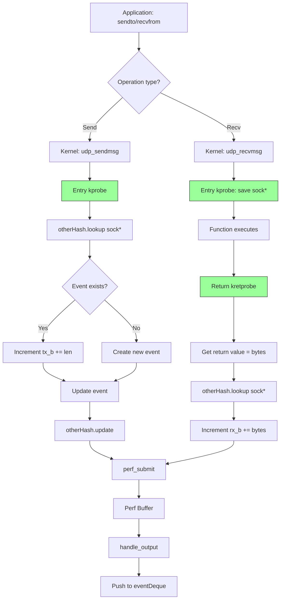

## Overview

Event collection is the core function of the eBPF Event Interceptor. This page details how network events flow from kernel kprobes through perf buffers to user space queues, including data structures, attribution mechanisms, and performance optimizations.

<Info>
Both TCP and UDP interceptors follow similar collection patterns but differ in event structures and enrichment strategies.
</Info>

## Event Data Structures

### TCP Event Structure

Defined in `tcpEvent/common.h:19-36`:

```c
#pragma pack(push, 1)  // Ensure no padding for BPF compatibility
struct event_t {
    uint64_t EventTime;           // Timestamp (ns since boot)
    uint64_t ts_us;               // Microsecond timestamp
    uint32_t pid;                 // Process ID
    uint32_t UserId;              // User ID (UID)
    unsigned __int128 saddr;      // Source address (IPv4/IPv6)
    unsigned __int128 daddr;      // Destination address (IPv4/IPv6)
    uint64_t rx_b;                // Bytes received
    uint64_t tx_b;                // Bytes transmitted
    uint32_t tcpi_segs_out;       // TCP segments sent
    uint32_t tcpi_segs_in;        // TCP segments received
    uint64_t span_us;             // Connection duration
    uint16_t family;              // Address family (AF_INET/AF_INET6)
    uint16_t SPT;                 // Source port
    uint16_t DPT;                 // Destination port
    char task[128];               // Process command name
};
#pragma pack(pop)
```

<Note>
Using `unsigned __int128` for addresses allows storing both IPv4 (32-bit) and IPv6 (128-bit) addresses in a single field.
</Note>

### TCP Consumer Event Structure

Defined in `tcpEvent/common.h:39-54`:

```c
#pragma pack(push, 1)
struct tcp_event_t {  // Exported to consumer applications
    uint64_t EventTime;           // Adjusted to wall-clock time
    uint32_t pid;
    uint32_t UserId;
    uint64_t rx_b;
    uint64_t tx_b;
    uint32_t tcpi_segs_out;
    uint32_t tcpi_segs_in;
    uint16_t family;
    uint16_t SPT;
    uint16_t DPT;
    char task[128];
    char SADDR[128];              // Human-readable source IP
    char DADDR[128];              // Human-readable dest IP
};
#pragma pack(pop)
```

**Key Differences:**
- IP addresses converted from binary to strings (e.g., "192.168.1.1")
- Timestamp adjusted from boot time to epoch time
- Simplified fields relevant to consumers

### UDP Event Structures

Defined in `udpEvent/common.h:25-41`:

```c
// Internal event (from eBPF program)
#pragma pack(push, 1)
struct event_t {
    uint16_t family;
    uint32_t pid;
    uint32_t UserId;
    uint64_t EventTime;
    uint16_t SPT;
    uint16_t DPT;
    char task[16];                // Smaller: filled by bpf_get_current_comm
    unsigned __int128 saddr;
    unsigned __int128 daddr;
    uint64_t rx_b;
    uint64_t tx_b;
    uint32_t rxPkts;              // Packet counts (UDP-specific)
    uint32_t txPkts;
    uintptr_t sockPtr;            // Socket pointer for tracking
};
#pragma pack(pop)
```

```c
// Consumer event (exported to applications)
#pragma pack(push, 1)
struct udp_event_t {
    uint16_t family;
    uint32_t pid;
    uint32_t UserId;
    uint64_t EventTime;
    uint16_t SPT;
    uint16_t DPT;
    char task[16];
    uint64_t rx_b;
    uint64_t tx_b;
    uint32_t rxPkts;
    uint32_t txPkts;
    char SADDR[64];               // Smaller than TCP (max IPv6 string)
    char DADDR[64];
};
#pragma pack(pop)
```

<Warning>
Struct packing (`#pragma pack(push, 1)`) is critical. Without it, the C++ compiler adds padding that breaks eBPF-to-userspace data transfer.
</Warning>

## Event Capture Flow

### TCP Event Capture

```mermaid
flowchart TB
    A[Application calls socket API] --> B[Kernel: tcp_set_state]
    B --> C[Kprobe triggers eBPF]
    C --> D[eBPF: Read struct sock]
    D --> E[eBPF: perf_submit event]
    E --> F[Perf Buffer]
    F --> G[User Space: poll_perf_buffer]
    G --> H[handle_output callback]
    H --> I{Queue full?}
    I -->|Yes| J[Drop oldest event]
    I -->|No| K[Push to eventDeque]
    J --> K
    K --> L[Signal consumer]
    
    M[Netlink Thread] -.Every 6.2s.-> N[Query socket diagnostics]
    N --> O[Match inode to PID]
    O --> P[Extract TCP statistics]
    P --> Q[Create netlink event]
    Q --> I
    
    style M fill:#f9f,stroke:#333
    style N fill:#f9f,stroke:#333
    style O fill:#f9f,stroke:#333
    style P fill:#f9f,stroke:#333
    style Q fill:#f9f,stroke:#333
```

### UDP Event Capture



## Kprobe Attachment and Event Generation

### TCP Kprobe Implementation

The TCP interceptor uses a single kprobe on `tcp_set_state` (event.cc:187-194):

```cpp
auto attach = bpf.attach_kprobe(FN_NAME, "kprobe__tcp_set_state");
auto attachCode = attach.code();
if (attachCode) {
    std::cerr << attach.msg() << std::endl;
    exit(1);
}
puts("--> bpf.attach_kprobe OK");
```

The eBPF program (loaded from external source) extracts:
- Socket addresses and ports from `struct sock*`
- PID/UID from current process context
- Timestamp from `bpf_ktime_get_ns()`
- TCP state transition information

### UDP Kprobe Implementation

The UDP interceptor attaches 9 kprobes to track stateless operations:

<Accordion title="UDP Kprobe Details">
**1. Connection Tracking (2 probes):**
```cpp
bpf.attach_kprobe("ip4_datagram_connect", "kprobe_ip4_datagram_connect");
bpf.attach_kprobe("ip6_datagram_connect", "kprobe_ip6_datagram_connect");
```
Called when application uses `connect()` on UDP socket (optional for UDP).

**2. Send Operations (2 probes):**
```cpp
bpf.attach_kprobe("udp_sendmsg", "kprobe__udp_sendmsg");
bpf.attach_kprobe("udpv6_sendmsg", "kprobe__udpv6_sendmsg");
```
Capture bytes sent via `sendto()` or `send()`.

**3. Receive Operations (4 probes):**
```cpp
// IPv4
bpf.attach_kprobe("udp_recvmsg", "kprobe_udp_recvmsg");
bpf.attach_kprobe("udp_recvmsg", "kretprobe__udp_recvmsg", 
                  0, BPF_PROBE_RETURN, 0);

// IPv6
bpf.attach_kprobe("udpv6_recvmsg", "kprobe__udpv6_recvmsg");
bpf.attach_kprobe("udpv6_recvmsg", "kretprobe__udpv6_recvmsg",
                  0, BPF_PROBE_RETURN, 0);
```
Entry probe saves socket pointer, return probe captures bytes received.

**4. Cleanup (1 probe):**
```cpp
bpf.attach_kprobe("udp_destruct_sock", "kprobe_udp_destruct_sock");
```
Submits final statistics when socket is closed.
</Accordion>

## Perf Buffer Mechanics

### Buffer Declaration

**TCP eBPF program:**
```c
BPF_PERF_OUTPUT(tcpEvents);  // Macro creates perf buffer
```

**UDP eBPF program (udpTracer.cc:84):**
```c
BPF_PERF_OUTPUT(bpfPerfBuffer);
```

### Opening Perf Buffer

From event.cc:196-203:

```cpp
auto openResults = bpfPtr->open_perf_buffer(TABLE, &handle_output);
auto openResultsCode = openResults.code();
if (openResultsCode) {
    std::cerr << openResults.msg() << std::endl;
    exit(1);
}
puts("--> bpf.open_perf_buffer OK");
```

The `handle_output` callback is invoked for every event:

```cpp
void handle_output(void *cb_cookie, void *data, int data_size) {
    (void)data_size;  // Unused
    (void)cb_cookie;  // Unused
    
    auto event = static_cast<event_t*>(data);
    if (event) {
        pthread_mutex_lock(&mtx);
        // ... queue management ...
        eventDeque.push_back(event);
        pthread_mutex_unlock(&mtx);
        pthread_cond_signal(&cond);  // Wake consumer
    }
}
```

### Polling Loop

From event.cc:216-219:

```cpp
while (1) {
    bpf.poll_perf_buffer(TABLE);  // Blocks until event or timeout
}
```

<Info>
`poll_perf_buffer()` internally uses `epoll()` to efficiently wait for events without busy-waiting.
</Info>

## Event Queue Management

### Queue Configuration

Both libraries use `std::deque` with a maximum size:

```cpp
#define MAXQSIZE 1024
std::deque<event_t*> eventDeque;  // Global queue
```

### Queue Protection

Multi-threaded access requires synchronization:

```cpp
pthread_mutex_t mtx = PTHREAD_MUTEX_INITIALIZER;  // Protects deque
pthread_cond_t cond = PTHREAD_COND_INITIALIZER;   // Signals consumers
```

### Enqueue with Shedding

From event.cc:67-88:

```cpp
void handle_output(void *cb_cookie, void *data, int data_size) {
    auto event = static_cast<event_t*>(data);
    if (event) {
        int shed = 0;
        struct event_t *almostGone = 0;
        
        pthread_mutex_lock(&mtx);
        
        if (eventDeque.size() > MAXQSIZE) {
            shed++;
            almostGone = eventDeque.front();  // Oldest event
            eventDeque.pop_front();
        }
        
        eventDeque.push_back(event);  // Add new event
        pthread_mutex_unlock(&mtx);
        pthread_cond_signal(&cond);   // Wake waiting consumer
        
        if (shed) {
            destroyEventPtr(almostGone);  // Free dropped event
            puts("Shedding TCP events..");
        }
    }
}
```

<Warning>
**Backpressure Handling:** When events are shed, the oldest events are lost. Applications should drain the queue frequently to avoid data loss.
</Warning>

### Dequeue with Blocking

From event.cc:113-169:

```cpp
struct tcp_event_t DequeuePerfEvent() {
    while (1) {
        pthread_mutex_lock(&mtx);
        
        // Initialize netlink thread on first call
        if (!netLinkInit) {
            netLinkInit++;
            std::thread t2(netLinkProbe);
            t2.detach();
        }
        
        if (!eventDeque.empty()) {
            auto event = eventDeque.front();
            eventDeque.pop_front();
            pthread_mutex_unlock(&mtx);
            
            // Convert internal event to consumer format
            memset(&toConsumer, 0, sizeof(toConsumer));
            toConsumer.EventTime = event->EventTime + notSoLongAgo;
            toConsumer.pid = event->pid;
            // ... copy all fields ...
            
            // Convert binary IPs to strings
            switch (event->family) {
            case AF_INET:
                inet_ntop(AF_INET, &(event->saddr), 
                         toConsumer.SADDR, sizeof(toConsumer.SADDR));
                inet_ntop(AF_INET, &(event->daddr),
                         toConsumer.DADDR, sizeof(toConsumer.DADDR));
                break;
            case AF_INET6:
                inet_ntop(AF_INET6, &(event->saddr),
                         toConsumer.SADDR, sizeof(toConsumer.SADDR));
                inet_ntop(AF_INET6, &(event->daddr),
                         toConsumer.DADDR, sizeof(toConsumer.DADDR));
                break;
            }
            
            memcpy(toConsumer.task, event->task, 
                   strnlen(event->task, 16));
            destroyEventPtr(event);
            
            return toConsumer;
        } else {
            // Queue empty: wait for signal
            pthread_cond_wait(&cond, &mtx);
            pthread_mutex_unlock(&mtx);
        }
    }
}
```

<Note>
`DequeuePerfEvent()` blocks indefinitely until an event is available. This design simplifies consumer code but requires careful shutdown handling.
</Note>

## Netlink Socket Diagnostics (TCP)

TCP events are enriched with detailed statistics via Linux netlink socket diagnostics.

### Architecture

```
┌──────────────────────────────────────────────────────────┐
│                    User Space                            │
│  ┌────────────────────────────────────────────────────┐  │
│  │         netLinkProbe Thread                        │  │
│  │  (Runs every 6.2 seconds)                          │  │
│  └─────────┬──────────────────────────────────────────┘  │
│            │                                              │
│            ▼                                              │
│  ┌─────────────────────┐      ┌────────────────────┐    │
│  │ findSocketInodes()  │      │ SockStrMap         │    │
│  │ Scan /proc/*/fd/*   │─────>│ "socket:[123]"→PID │    │
│  └─────────────────────┘      └────────────────────┘    │
│            │                                              │
│            ▼                                              │
│  ┌─────────────────────┐                                 │
│  │ getEvents()         │                                 │
│  │ - askForEvents()    │                                 │
│  │ - harvestEvents()   │                                 │
│  └──────────┬──────────┘                                 │
└─────────────┼─────────────────────────────────────────────┘
              │
              │ AF_NETLINK socket (NETLINK_SOCK_DIAG)
              ▼
┌─────────────────────────────────────────────────────────┐
│                     Linux Kernel                        │
│  ┌──────────────────────────────────────────────────┐  │
│  │        Socket Diagnostics Module                 │  │
│  │  - TCP connection table                          │  │
│  │  - Per-socket statistics (tcp_info)              │  │
│  └──────────────────────────────────────────────────┘  │
└─────────────────────────────────────────────────────────┘
```

### Netlink Probe Thread

From event.cc:293-309:

```cpp
void netLinkProbe() {
    netLinkTid = pthread_self();
    while (1) {
        findSocketInodes();  // Build inode→PID map
        
        if (!SockStrMap.size()) {
            puts("SockStrMap empty - cannot attribute events");
            sleep(2);
            continue;
        }
        
        if (getEvents()) {
            // Successfully retrieved socket statistics
        } else {
            puts("Got NO netLink Events!");
        }
        
        sleep(NETLINKNAP);  // 6.2 seconds
    }
}
```

### Finding Socket Inodes

From event.cc:328-386:

```cpp
int findSocketInodes() {
    SockStrMap.clear();  // Reset map
    
    glob_t globbuf;
    int ret = glob(GLOBTHIS, 0, 0, &globbuf);  // "/proc/[0-9]*/fd/*"
    
    if (ret || !globbuf.gl_pathc) return -1;
    
    int i = 0;
    char symlinkName[SYMLINK_LEN] = {0};
    char *path = 0;
    char pidTxt[BUF] = {0};
    uint32_t pid = 0;
    
    while (globbuf.gl_pathv[i]) {
        path = globbuf.gl_pathv[i];
        i++;
        
        // Read symlink: "/proc/1234/fd/5" → "socket:[67890]"
        if (readlink(path, symlinkName, SYMLINK_LEN_B) < 0)
            continue;
        
        // Check if it's a socket
        if (memcmp(symlinkName, ISSOCK, ISSOCKLen))  // "socket:["
            continue;
        
        // Extract PID from path
        if (!findNthWord(path, 1, pidTxt, slash))
            continue;
        
        pid = strtod(pidTxt, &err);
        if (pid) {
            SockStrMap[std::string(symlinkName)] = pid;
        }
    }
    
    globfree(&globbuf);
    return 0;
}
```

### Requesting Socket Statistics

From event.cc:414-466:

```cpp
int sendDiagMsg(int nlSocket, int family) {
    // Build request for TCP socket info
    struct inet_diag_req_v2 connRequest = {};
    connRequest.sdiag_family = family;     // AF_INET or AF_INET6
    connRequest.sdiag_protocol = IPPROTO_TCP;
    connRequest.idiag_states = TCPF_ALL &  // All states except:
        ~((1 << TCP_SYN_RECV) |            // - SYN received
          (1 << TCP_TIME_WAIT) |           // - Time wait
          (1 << TCP_CLOSE));               // - Closed
    connRequest.idiag_ext |= (1 << (INET_DIAG_INFO - 1));
    
    // Build netlink message
    struct nlmsghdr nlh = {};
    nlh.nlmsg_len = NLMSG_LENGTH(sizeof(connRequest));
    nlh.nlmsg_flags = NLM_F_DUMP | NLM_F_REQUEST;
    nlh.nlmsg_type = SOCK_DIAG_BY_FAMILY;
    
    struct sockaddr_nl sa = {};
    sa.nl_family = AF_NETLINK;
    
    // Send via scatter-gather I/O
    struct iovec iov[3] = {};
    iov[0].iov_base = (void*)&nlh;
    iov[0].iov_len = sizeof(nlh);
    iov[1].iov_base = (void*)&connRequest;
    iov[1].iov_len = sizeof(connRequest);
    
    struct msghdr msg = {};
    msg.msg_name = (void*)&sa;
    msg.msg_namelen = sizeof(sa);
    msg.msg_iov = &iov[0];
    msg.msg_iovlen = 2;
    
    return sendmsg(nlSocket, &msg, 0);
}
```

### Parsing Netlink Responses

From event.cc:520-646:

```cpp
void parseReply(struct inet_diag_msg *reply, int rtalen) {
    if (!reply->idiag_inode) return;  // Need inode for matching
    
    // Check queue capacity
    pthread_mutex_lock(&mtx);
    auto curSize = eventDeque.size();
    pthread_mutex_unlock(&mtx);
    
    if (curSize > MAXQSIZE) {
        puts("Shedding TCP (Netlink) events..");
        return;
    }
    
    // Look up PID by inode
    char lookThisUp[BUF] = {0};
    snprintf(lookThisUp, BUF, "socket:[%u]", reply->idiag_inode);
    
    if (!SockStrMap.count(lookThisUp)) return;  // Not in our map
    
    uint32_t pid = SockStrMap[lookThisUp];
    if (!pid) return;
    
    // Allocate new event
    event_t *netlinkEvent = new event_t();
    
    // Timestamp
    auto up = upSince();
    netlinkEvent->EventTime = up * 1000000000LLU;
    
    // Read command name from /proc
    if (readCmdLine(pid, netlinkEvent->task, 128) < 0)
        goto EndofRunWay;
    
    // Basic info
    netlinkEvent->pid = pid;
    netlinkEvent->UserId = reply->idiag_uid;
    netlinkEvent->family = reply->idiag_family;
    
    // Extract addresses
    switch (netlinkEvent->family) {
    case AF_INET6:
        memcpy(&netlinkEvent->saddr, reply->id.idiag_src, 16);
        memcpy(&netlinkEvent->daddr, reply->id.idiag_dst, 16);
        break;
    default:  // AF_INET
        netlinkEvent->saddr = *reply->id.idiag_src;
        netlinkEvent->daddr = *reply->id.idiag_dst;
        break;
    }
    
    // Ports
    netlinkEvent->SPT = ntohs(reply->id.idiag_sport);
    netlinkEvent->DPT = ntohs(reply->id.idiag_dport);
    
    // Parse routing attributes for TCP stats
    struct rtattr *routeAttributes;
    struct anu_tcp_info *info;
    int ok = 0;
    
    if (rtalen) {
        routeAttributes = (struct rtattr*)(reply + 1);
        while (RTA_OK(routeAttributes, rtalen)) {
            if (routeAttributes->rta_type == INET_DIAG_INFO) {
                info = (struct anu_tcp_info*)RTA_DATA(routeAttributes);
                
                // Extract statistics
                netlinkEvent->tcpi_segs_in = info->tcpi_segs_in;
                netlinkEvent->rx_b = info->tcpi_bytes_received;
                netlinkEvent->tcpi_segs_out = info->tcpi_segs_out;
                netlinkEvent->tx_b = info->tcpi_bytes_sent;
                ok++;
            }
            routeAttributes = RTA_NEXT(routeAttributes, rtalen);
        }
    }
    
EndofRunWay:
    if (ok) {
        // Add to tracking map
        pthread_mutex_lock(&mapMu);
        PtrMap[netlinkEvent] = up;
        pthread_mutex_unlock(&mapMu);
        
        // Enqueue event
        pthread_mutex_lock(&mtx);
        eventDeque.push_back(netlinkEvent);
        pthread_mutex_unlock(&mtx);
        pthread_cond_signal(&cond);
    } else {
        delete(netlinkEvent);  // Didn't get stats
    }
}
```

<Info>
Netlink events are created independently of kprobe events, providing periodic snapshots of active connections even without state changes.
</Info>

### Custom TCP Info Structure

From common.h:75-148:

```c
struct anu_tcp_info {
    uint8_t tcpi_state;
    uint8_t tcpi_ca_state;
    // ... many fields ...
    uint64_t tcpi_bytes_received;  // RFC4898 tcpEStatsAppHCThruOctetsReceived
    uint32_t tcpi_segs_out;        // RFC4898 tcpEStatsPerfSegsOut
    uint32_t tcpi_segs_in;         // RFC4898 tcpEStatsPerfSegsIn
    // ... more fields ...
    uint64_t tcpi_bytes_sent;      // RFC4898 tcpEStatsPerfHCDataOctetsOut
    // ... 40+ total fields ...
};
```

<Note>
The custom `anu_tcp_info` struct extends standard `tcp_info` to include `tcpi_bytes_sent`, which is essential for accurate bandwidth accounting.
</Note>

## Process Attribution Mechanism

### Reading Process Command Line

From event.cc:661-681:

```cpp
int readCmdLine(uint32_t pid, char *writeTo, int maxLen) {
    if (!pid) return -1;
    if (maxLen > MAX) return -1;
    
    char cmdLine[MAX] = {0};
    snprintf(cmdLine, 128, "/proc/%u/cmdline", pid);
    
    FILE *fp = fopen(cmdLine, "r");
    if (!fp) {
        perror("fopen");
        return -1;
    }
    
    int weRead = fread(writeTo, maxLen, 1, fp);
    fclose(fp);
    return weRead;
}
```

<Warning>
`/proc/[pid]/cmdline` uses null bytes as separators. The command name is the first null-terminated string.
</Warning>

### eBPF Process Context

Inside eBPF programs, process information comes from BPF helpers:

```c
// Get PID and thread group ID
u64 pid_tgid = bpf_get_current_pid_tgid();
eventPtr->pid = pid_tgid >> 32;

// Get user ID
u64 uid_gid = bpf_get_current_uid_gid();
eventPtr->UserId = uid_gid & 0xffffffff;

// Get command name (max 16 chars)
bpf_get_current_comm(eventPtr->task, sizeof(eventPtr->task));
```

<Note>
Command names from eBPF are limited to 16 characters (TASK_COMM_LEN). The netlink enrichment path reads full command lines from /proc.
</Note>

## Event Deduplication and Cleanup

### TCP Memory Tracking

From event.cc:29-30:

```cpp
std::deque<event_t*> eventDeque;        // Queue of events
std::map<event_t*, int> PtrMap;         // Track allocated events
```

The `PtrMap` prevents double-free errors:

```cpp
void destroyEventPtr(event_t* eventPtr) {
    if (!eventPtr) return;
    
    int found = 0;
    int erased = 0;
    
    pthread_mutex_lock(&mapMu);
    found = PtrMap.count(eventPtr);
    erased = PtrMap.erase(eventPtr);
    pthread_mutex_unlock(&mapMu);
    
    if (found && erased) {
        delete(eventPtr);  // Safe to free
        eventPtr = 0;
    }
}
```

### UDP Socket Tracking

From udpTracer.cc:84-86 (in eBPF program):

```c
BPF_HASH(magic, u64, unsigned long);           // pid_tgid → sock*
BPF_HASH(otherHash, uintptr_t, struct event_t); // sock* → event_t
```

**Purpose:**
- `magic`: Correlates entry and return probes for same syscall
- `otherHash`: Accumulates per-socket statistics across multiple operations

**Lifecycle:**
```c
// Entry probe: save socket pointer
u64 pidTgid = bpf_get_current_pid_tgid();
uintptr_t pointerInt = (uintptr_t)sk;
magic.update(&pidTgid, &pointerInt);

// Return probe: retrieve and use
unsigned long *found = magic.lookup(&pidTgid);
if (found) {
    struct event_t *eventPtr = otherHash.lookup(found);
    eventPtr->rx_b += bytes_received;
    magic.delete(&pidTgid);  // Clean up
}
```

### Cleanup on Socket Destruction

From udpTracer.cc:182-204 (eBPF program):

```c
int kprobe_udp_destruct_sock(struct pt_regs *ctx, struct sock *sk) {
    uintptr_t pointerInt = (uintptr_t)sk;
    struct event_t *eventPtr = otherHash.lookup(&pointerInt);
    
    if (eventPtr) {
        bpfHelper(eventPtr);  // Final update
        skHelper(ctx, eventPtr, sk);  // Submit to user space
        
        if (eventPtr->pid) {
            bpfPerfBuffer.perf_submit(ctx, eventPtr, sizeof(*eventPtr));
            otherHash.delete(&sk);  // Clean up map entry
        }
    }
    
    return 0;
}
```

<Info>
When a UDP socket closes, `udp_destruct_sock` is called, triggering final statistics submission and map cleanup.
</Info>

## Performance Optimizations

### Event Batching

Perf buffers naturally batch events for efficient transfer:
- Kernel accumulates events in ring buffer
- `poll_perf_buffer()` retrieves multiple events per syscall
- Callback invoked once per event

### Lock Granularity

```cpp
// TCP uses three locks for different resources
pthread_mutex_t mtx;        // Protects eventDeque (frequent)
pthread_mutex_t mapMu;      // Protects PtrMap (less frequent)
pthread_rwlock_t rwlock;    // Protects status (read-heavy)
```

Separate locks reduce contention between:
- Event producers (kprobes + netlink)
- Event consumers (DequeuePerfEvent)
- Memory tracking (destroyEventPtr)

### Zero-Copy Address Handling

```cpp
// IPv4: 32-bit address fits in 128-bit field
event->saddr = sk->__sk_common.skc_rcv_saddr;  // Direct assignment

// IPv6: 128-bit requires probe_read
bpf_probe_read_kernel(&event->saddr, sizeof(event->saddr),
    sk->__sk_common.skc_v6_rcv_saddr.in6_u.u6_addr32);
```

### Conditional netlink Polling

From event.cc:117-121:

```cpp
if (!netLinkInit) {
    netLinkInit++;  // Start only once
    std::thread t2(netLinkProbe);
    t2.detach();
}
```

Netlink thread starts lazily on first `DequeuePerfEvent()` call, avoiding overhead if never consumed.

## Timestamp Synchronization

### Boot Time Calculation

From event.cc:258-283:

```cpp
static uint64_t upSince() {
    FILE *fp = fopen(UPTIME, "r");  // "/proc/uptime"
    if (!fp) {
        perror("fopen");
        exit(1);
    }
    
    char temp[MAX] = {0};
    char *mustNotbeEmpty = fgets(temp, MAX, fp);
    if (!mustNotbeEmpty) {
        fprintf(stderr, "fgets err\n");
        exit(1);
    }
    fclose(fp);
    
    double firstWord = 0;
    sscanf(temp, "%lf", &firstWord);  // Seconds since boot
    if (!firstWord) {
        fprintf(stderr, "failed to get uptime details\n");
        exit(1);
    }
    return firstWord;
}

static uint64_t whenDidWeBootUp() {
    auto firstWord = upSince();
    double weCameUpAt = ((uint64_t)time(0) - firstWord);
    return weCameUpAt;  // Epoch time of boot
}
```

### Timestamp Adjustment

From event.cc:128-133:

```cpp
if (!notSoLongAgo) {
    notSoLongAgo = whenDidWeBootUp() * 1000000000LLU;  // Boot time in ns
}

toConsumer.EventTime = event->EventTime + notSoLongAgo;
// event->EventTime = ns since boot (from bpf_ktime_get_ns())
// toConsumer.EventTime = ns since epoch
```

<Note>
`bpf_ktime_get_ns()` returns monotonic time since boot. Adding the boot epoch time converts to wall-clock time for consumer applications.
</Note>

## Complete Event Flow Example

### TCP Connection Event

```
1. Application: connect(fd, server_addr, ...)
   ↓
2. Kernel: tcp_set_state(sk, TCP_SYN_SENT)
   ↓
3. eBPF kprobe__tcp_set_state:
   - Read sk->skc_family, sk->skc_daddr, sk->skc_dport
   - Call bpf_get_current_pid_tgid() → PID
   - Call bpf_ktime_get_ns() → timestamp
   - Build event_t struct
   - tcpEvents.perf_submit(ctx, &event, sizeof(event))
   ↓
4. Perf Buffer (kernel ring buffer)
   ↓
5. User Space: bpf.poll_perf_buffer("tcpEvents")
   ↓
6. handle_output(data):
   - Cast to event_t*
   - Check queue size, shed if needed
   - eventDeque.push_back(event)
   - pthread_cond_signal(&cond)
   ↓
7. Application: DequeuePerfEvent()
   - pthread_cond_wait() wakes up
   - event = eventDeque.front()
   - Convert event->EventTime to wall clock
   - inet_ntop() addresses to strings
   - Return tcp_event_t to application
```

### UDP Send Event

```
1. Application: sendto(fd, buffer, len, 0, dest_addr, ...)
   ↓
2. Kernel: udp_sendmsg(sk, msg, len)
   ↓
3. eBPF kprobe__udp_sendmsg:
   - uintptr_t sockPtr = (uintptr_t)sk
   - eventPtr = otherHash.lookup(&sockPtr)
   - if (eventPtr):
       eventPtr->tx_b += len
       eventPtr->txPkts += 1
   - else:
       Create new event_t with tx_b = len, txPkts = 1
   - otherHash.update(&sockPtr, eventPtr)
   - bpfPerfBuffer.perf_submit(ctx, eventPtr, sizeof(*eventPtr))
   ↓
4. Perf Buffer
   ↓
5. handle_output → eventDeque → DequeuePerfEvent()
   ↓
6. Application receives udp_event_t
```

## Error Handling and Edge Cases

### Short-Lived Processes

**Problem:** Process exits before /proc read

**Mitigation:**
```cpp
if (readCmdLine(pid, netlinkEvent->task, 128) < 0)
    goto EndofRunWay;  // Event still created, but task[0] = '\0'
```

Consumers should check for empty task names.

### IPv4 vs IPv6 Detection

```cpp
switch (event->family) {
case AF_INET:   // 2
    inet_ntop(AF_INET, &(event->saddr), str, len);
    break;
case AF_INET6:  // 10
    inet_ntop(AF_INET6, &(event->saddr), str, len);
    break;
default:
    fprintf(stderr, "Unknown inet family: %d\n", event->family);
    continue;  // Skip malformed event
}
```

### Queue Overflow

**Detection:**
```cpp
if (eventDeque.size() > MAXQSIZE) {
    puts("Shedding TCP events..");
}
```

**Prevention:** Increase `MAXQSIZE` or process events faster

## Next Steps

<CardGroup cols={2}>
  <Card title="Getting Started" icon="rocket" href="/installation">
    Build and run the eBPF Event Interceptor
  </Card>
  
  <Card title="TCP API Reference" icon="code" href="/api/tcp/overview">
    Learn how to consume TCP events in your application
  </Card>
  
  <Card title="UDP API Reference" icon="code" href="/api/udp/overview">
    Learn how to consume UDP events in your application
  </Card>
</CardGroup>